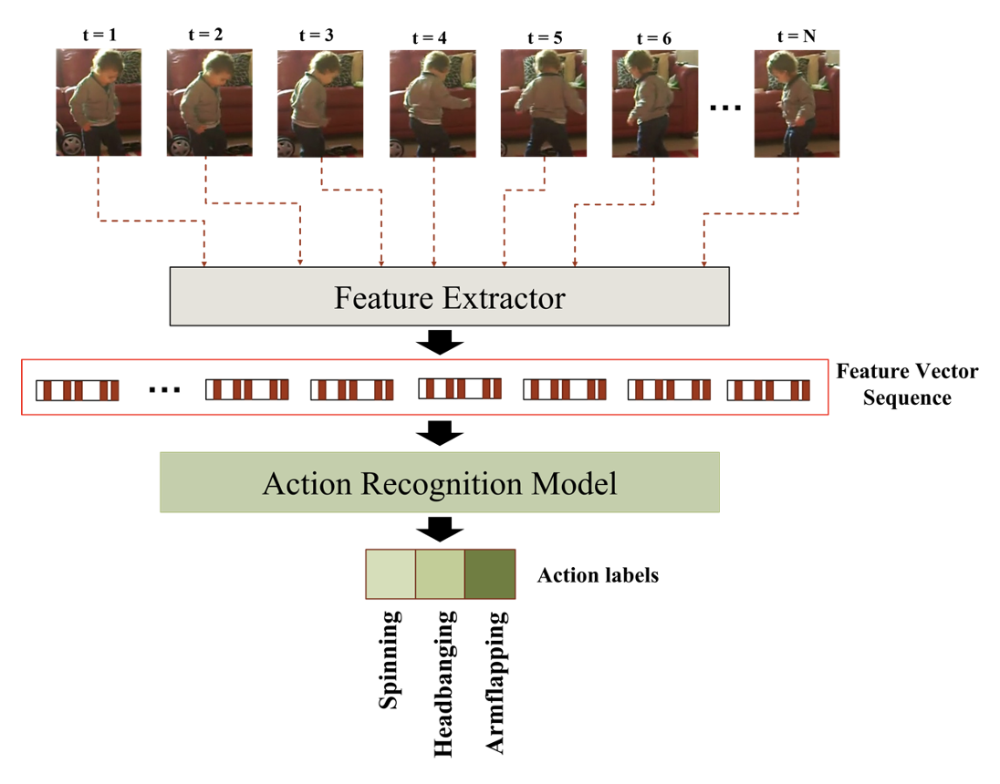
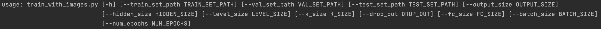
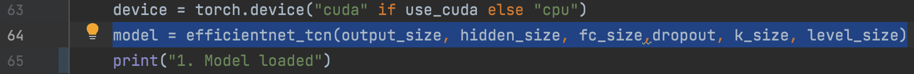

# Activity Recognition in Children with Autism-Related Behaviors

Advances in machine learning and contactless sensors have led to the capability of understanding complex human behaviors in a healthcare setting. 
In particular, several deep learning systems have been introduced to enable comprehensive analysis of neurodevelopmental conditions such as Autism Spectrum Disorder (ASD). This condition affects children from their early developmental stages onwards, and diagnosis relies entirely on observing the child’s behavior via behavioral cues. However, this diagnosis process is time-consuming due to the long-term behavior observation required, and the scarce availability of specialists. We demonstrate the effect of a region-based computer vision system to help clinicians and parents to analyze a child's behavior. For this purpose, we adopt and enhance a dataset for analyzing autism-related actions using videos of children captured in uncontrolled environments (e.g. videos collected with consumer-grade cameras). The data is pre-processed by detecting the target child in the video to reduce the impact of background noise. Motivated by the effectiveness of temporal convolutional models, we propose both light-weight and server models capable of extracting action features from video frames and classifying autism-related behaviors by analyzing the relationships between frames in a video. In extensive evaluations on the feature extraction and learning strategies, we demonstrate that the best performance is achieved with an Inflated 3D Convnet and Multi-Stage Temporal Convolutional Networks with 0.83 Weighted F1-score for classification of the three autism-related actions, which outperforms existing methods. We also propose a light-weight solution by adapting the ESNet backbone into the same system, reaching competitive results of 0.71 Weighted F1-score which enable potential deployment on embedded systems. 
### Dependencies
* Python >= 3.8
* [PyTorch](https://pytorch.org) >= 1.8
* [kinetics-i3d](https://github.com/deepmind/kinetics-i3d) (if you want to use i3d feature extractor)
* [EfficientNet](https://github.com/lukemelas/EfficientNet-PyTorch) or `pip install efficientnet_pytorch`

### Datasets
#### Original SSBD dataset
Due to ethical issues, publicly available datasets showing autism behavior are limited (we note that the dataset proposed by [Negin et al.](https://www.sciencedirect.com/science/article/abs/pii/S0925231221003544?casa_token=-XTv_sf8INEAAAAA:Aia27htKf_169G8568CbWA6t9IWdlGSWhDqu0HT9SHOTJFvC2fLnH4vNOi-VKNVcGxIpCf5XzrM) is not yet publicly available). We train and test all models on the publicly available [self-stimulatory behavior dataset (SSBD)](https://openaccess.thecvf.com/content_iccv_workshops_2013/W22/papers/Rajagopalan_Self-Stimulatory_Behaviours_in_2013_ICCV_paper.pdf). The videos in this dataset are diverse in nature and are recorded in an uncontrolled environment, and collected from different online portals such as YouTube, Vimeo, and Dailymotion. The complete set of videos reported by [Shyam et al.](https://openaccess.thecvf.com/content_iccv_workshops_2013/W22/papers/Rajagopalan_Self-Stimulatory_Behaviours_in_2013_ICCV_paper.pdf) comprises 75 videos, of which only 60 are downloadable due to privacy concerns. 

#### Modified SSBD dataset
Due to some videos are very noisy and are captured in a very dark environment in SSBD dataset, we collected new videos from YouTube to enhance the original dataset following the methodology proposed by the authors of the SSBD dataset. We manually curate the videos and categorized them into their corresponding autism-related behaviors. The final version of the dataset used on our experiments is composed of 61 videos and 61 subjects, and consists of 20, 21 and 20 videos for arm flapping, headbanging, and spinning, respectively.

|           |*Armflapping*|*Headbanging*|*Spinning*|
|:-----------------:|:--------:|:----------:|:-----------:|
| `No. Videos in original SSBD dataset ` |   23   |    19    |      18      |
| `No. Videos in the updated SSBD dataset ` |   20   |    21    |      20      |

The detail of each video in the modified SSBD dataset is shown in [url_list.pdf](url_list.pdf)

### Result

### Feature extractor
There are some feature extractors that you can use 
1. EfficientNet (Remember to install EfficientNet package)
2. MobileNet (Aleardy in this repository). This package is from https://github.com/d-li14/mobilenetv3.pytorch.
3. [kinetics-i3d](https://github.com/deepmind/kinetics-i3d). Due to license issues, you need to download by yourself and put this package under `extractor_models` folder. And then you can use `i3d_extractor.py` to extract features. 

### Training
#### with iamge features
1. Sorry. Due to ethical issues, I couldn't public the extracted features by i3d. Please use your own features (see 2.). In default, you can used my extracted features in `data/i3d_feature`. The features were extracted by I3D model that pre-trained on Kinetice dataset.  
  Run with `python train_with_features_tcn.py`（for TCN model） or `python train_with_features_ms_tcn.py` (for MS-TCN model) 
  Then, the trained model parameters will be saved in `model_zoo/your_model_zoo`
2. Using your own features 
   Put your features file under `data/other_features`. And change the command based on the instructions below:
   
   OR: 
   
#### with images 
Here is a example of using `EfficientNetB3+TCN` model. 
1. Put your images under `data/images`.  
2. run `python train_with_images.py`. And you can modify the command based on the fellowing instructions:

3. The trained model's parameters would be saved under `model_zoo/your_model_zoo`.  
4. If you want to use different model, just changed this line to your desired model.  

