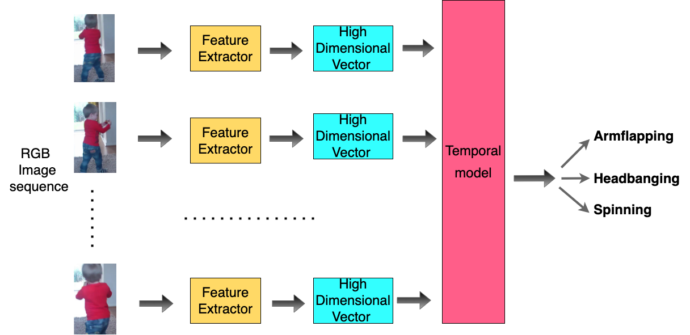
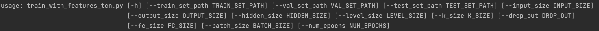
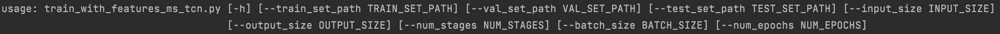

# Activity Recognition in Childrenwith Autism-Related Behaviours

Autism Spectrum Disorder (ASD), known as autism, is a lifelong developmental disorder that affects most children around the world. Analysing autism-related behaviours is a common way to diagnose ASD. However, this diagnosis process is time-consuming due to long-term behaviour observation and the scarce availability of specialists. Here, we propose a regain-based computer vision system to help clinicians and parents analyse children’s behaviours. We combinate and collected a dataset for analysing autism-related actions based on videos of children in an uncontrolled environment. Then pre-processed this dataset by cropping the target child from a video using Detectron2 person detection model to reduce the noise environment. We propose an approach that leverages current state-of-the-art CNN models to extract action features from videos per frame and utilizes temporal models to classify autism-related behaviours by analysing the relationship between frames within a video. The proposed method achieved 0.87 accuracy (F1-score 0.87) to classify the three actions in the collected dataset. The experimental results demonstrate the potential ability of our proposed model to reliable and accurately help clinicians diagnose ASD order and show the video-based model can efficiently speed up the diagnose process of ASD.

### Datasets
Self-Stimulatory Behaviour Dataset (SSBD) is the only one publicly available dataset. The dataset’s videos are in nature and recorded in an uncontrolled environment [1]. Three actions in this dataset: Armflapping, Headbanging, and Spinning. The total actual videos reported in original paper was 75 videos, in    which only 60 are downloadable due to privacy concerns of Youtube. In this dataset, some of videos are too noisy (almost in a very dark environment). We collected a few new videos from Youtube to replace these noisy videos in the dataset. In our new dataset, there are total 61 videos. Here are the detail of this new dataset: 

|           |*Armflapping*|*Headbanging*|*Spinning*|
|:-----------------:|:--------:|:----------:|:-----------:|
| `No. Videos in our new dataset ` |   20   |    21    |      20      |

### Training
#### with pre-processed features
1. In default, you can used my extracted features in `data/i3d_feature`. The features were extracted by I3D model that pre-trained on Kinetice dataset.  
  Run with `python train_with_features_tcn.py` or `python train_with_features_ms_tcn.py`  
  Then, the trained model parameters will be saved in `model_zoo/your_model_zoo`
2. Using your own features 
   Put your features file under `data/other_features`. And change the command based on the instructions below:
   
   OR: 
   
